---
# About

WarsawHUD is a Team Fortress 2 HUD with a focus on those with high resolution (1440p or greater) displays, and with an additional focus on visibility.

---

# Customization
## Scoreboard
Open `./customizations/scoreboard.res` and uncomment the scoreboard you want to use. For example:

To use 6v6:
```
// Select one by uncommenting it
// Make sure only one is commented at a time

"#base"	"/res/scoreboard_6v6.res"
//"#base"	"/res/scoreboard_9v9.res"
//"#base"	"res/scoreboard_12v12.res"
//"#base"	"/res/scoreboard_16v16.res"
```
And to switch back to 12v12:
```
// Select one by uncommenting it
// Make sure only one is commented at a time

//"#base"	"/res/scoreboard_6v6.res"
//"#base"	"/res/scoreboard_9v9.res"
"#base"	"res/scoreboard_12v12.res"
//"#base"	"/res/scoreboard_16v16.res"
```

## Crosshairs
You can select from a wide variety of custom crosshairs by editing the `./customizations/crosshair.res` file. Open it in notepad, and change the `labeltext` key to a corrosponding crosshair from the `./customizations/crosshairs.png` file.


For example, to use a TF2 logo shaped crosshair:

```
"Resource/HudLayout.res"
{
	"CustomCrosshair"
	{
		"visible"			"1"							// set to 1 to enable custom crosshairs
		"enabled"			"1"							// also set this to 1
		"labelText"			"g"							// check crosshairs.png for options
		"controlName"		"CExLabel"
		"fieldName"			"CustomCrosshair"
		"zpos"				"0"
		"xpos"				"cs-0.5"
		"ypos"				"cs-0.5"
		"wide"				"f0"
		"tall"				"f0"
		"font"				"Size:18 | Outline:OFF"		// set the size and outline of the crosshair here
		"textAlignment"		"center"
		"fgcolor"			"Crosshair"					// change this in colors.res
	}
}
```

## Hitmarker
You can enable a hitmarker effect to play whenever you damage an enemy. This can be edited near identically to the crosshair.

For example, to use a cross hitmarker:
```
"Resource/HudLayout.res"
{
	"Hitmarker"
	{
		"visible"			"1"							// set to 1 to enable custom crosshairs
		"enabled"			"1"							// also set this to 1
		"labelText"			"!"							// check crosshairs.png for options
		"controlName"		"CExLabel"
		"fieldName"			"Hitmarker"
		"zpos"				"0"
		"xpos"				"cs-0.5"
		"ypos"				"cs-0.5"
		"wide"				"f0"
		"tall"				"f0"
		"font"				"Size:14 | Outline:OFF"		// set the size and outline of the crosshair here
		"textAlignment"		"center"
		"fgcolor"			"Hitmarker"                 // change this in colors.res
		"alpha"				"0"
	}
}
```

## Favorite servers and Bookmarks
You can add custom favorited servers that you can quick-join in the main menu. To do this, open `./cfg/fav_servers.cfg`. You can also add custom commands to the main menu by editing `./cfg/bookmarks.cfg`.

## And more
Check the rest of `./customizations/`. There are plenty more things you can edit there, such as the HUD colors and in-game player model.

# Screenshots
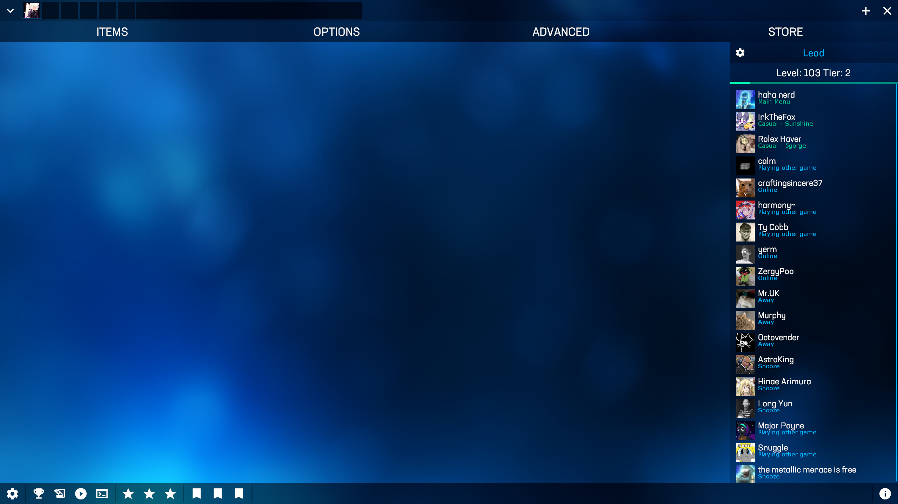
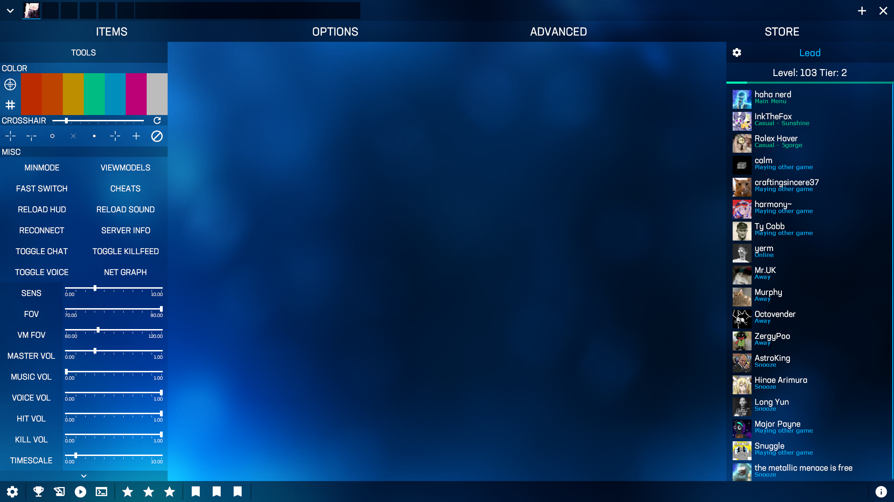
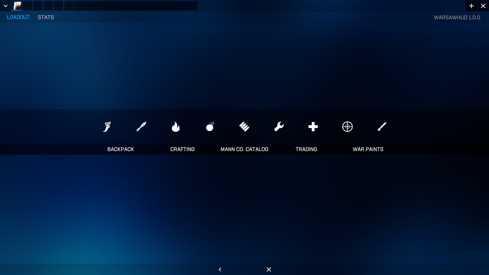
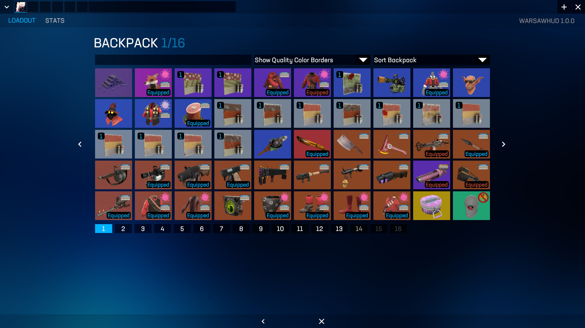
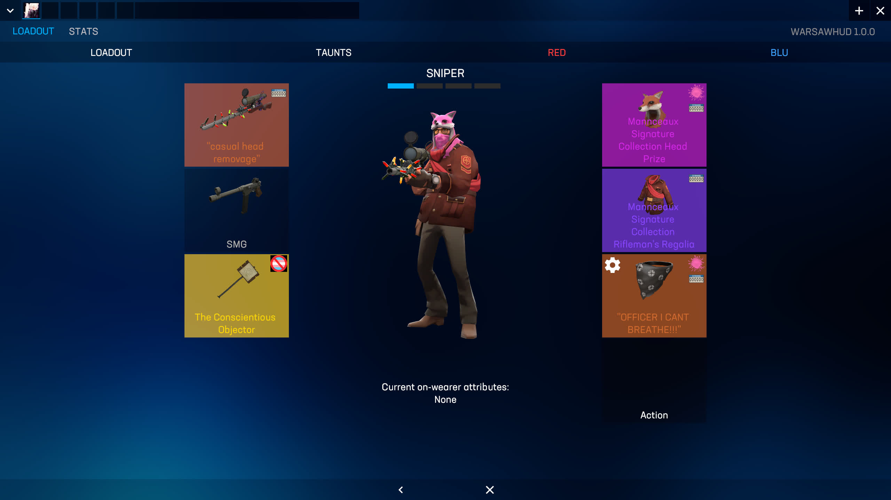
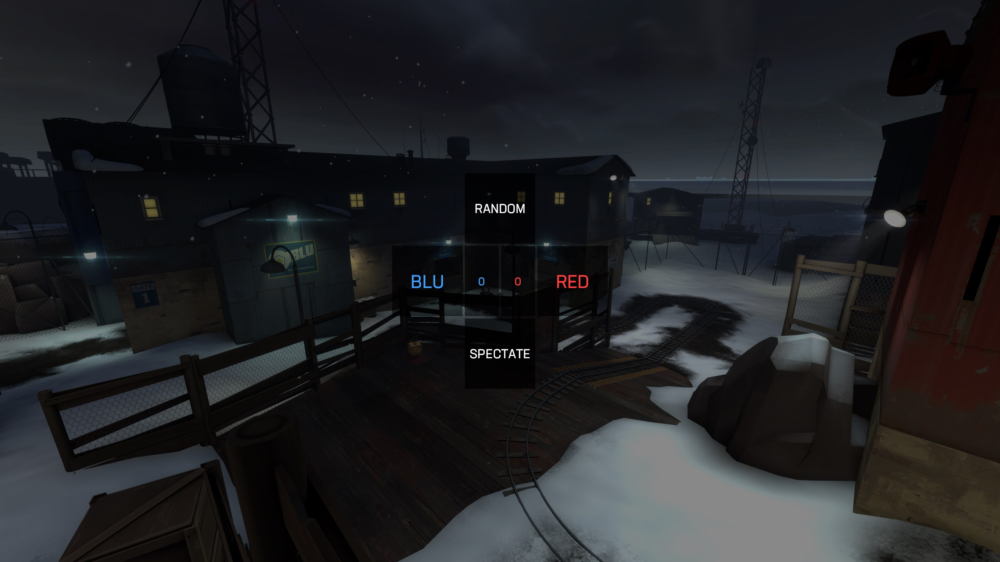
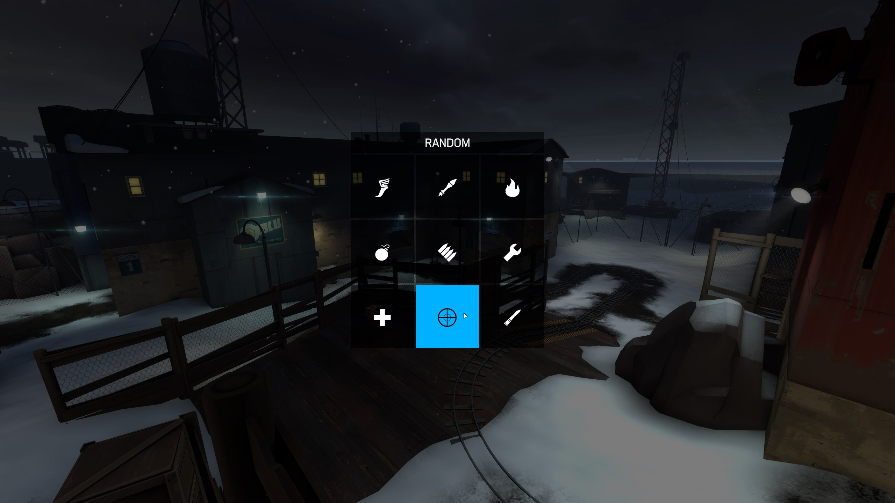
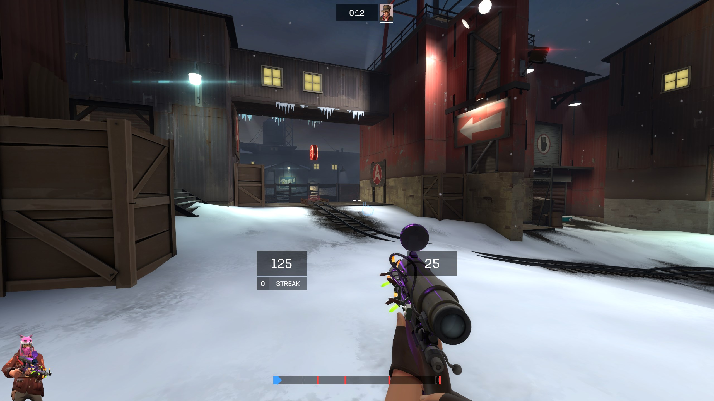
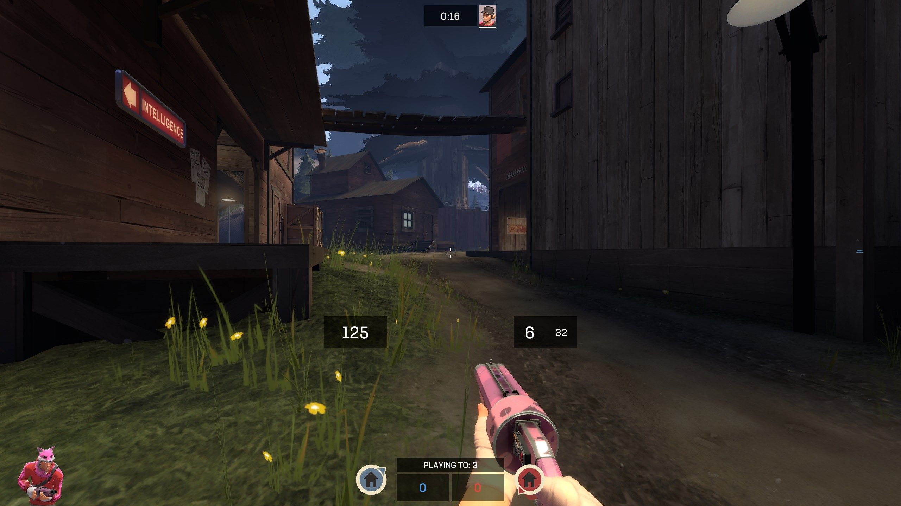
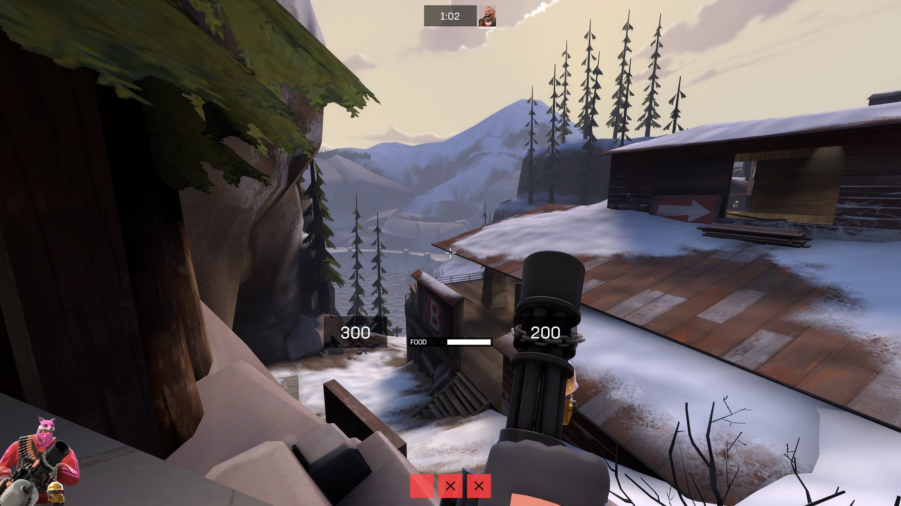
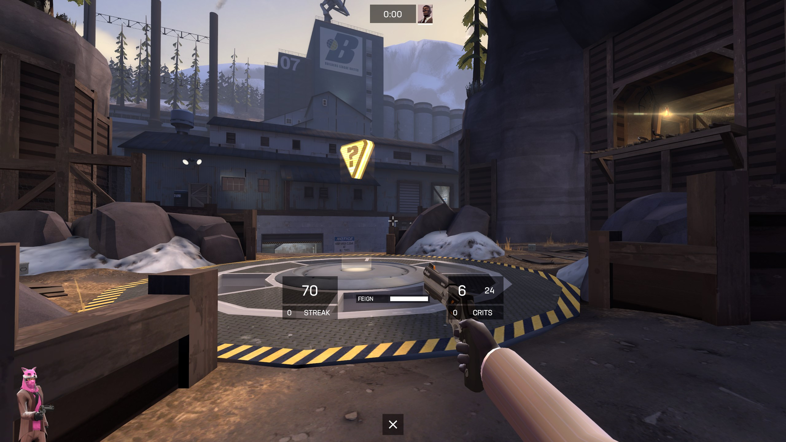